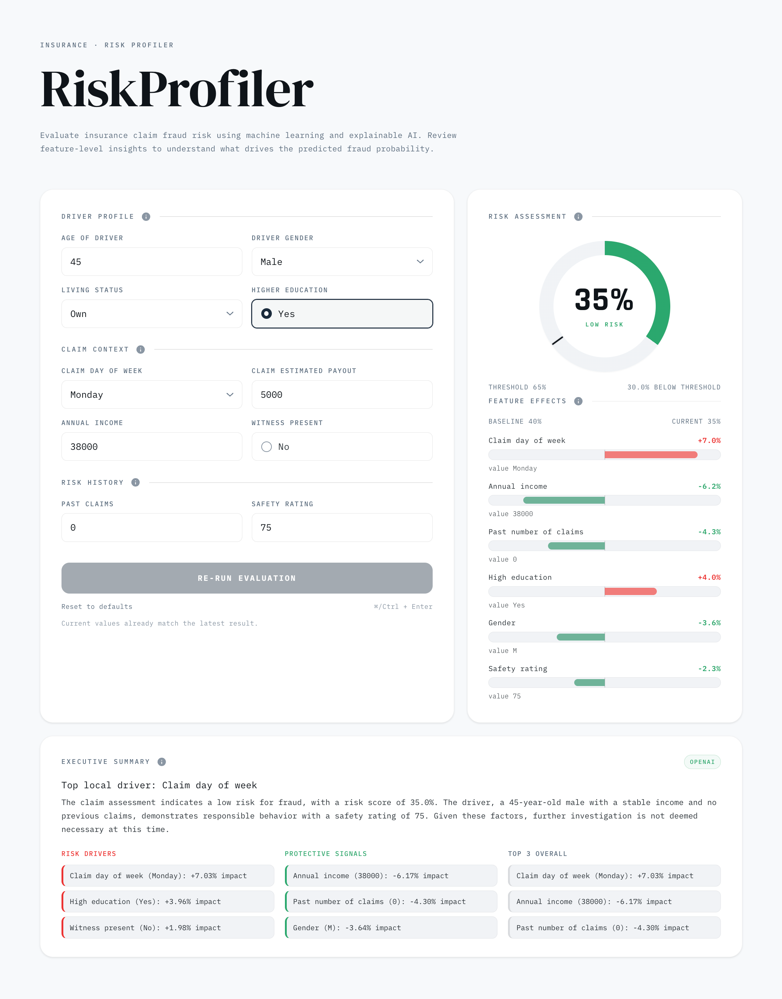

<div align="center">


# Insurance Claim Risk Profiler

[](https://www.python.org/downloads/)
[](https://www.typescriptlang.org/)
[](https://fastapi.tiangolo.com/)
[](https://nextjs.org/)
[](https://react.dev/)
[](https://scikit-learn.org/)
[](https://www.docker.com/)

Machine learning prototype for profiling risk in insurance claims using AutoGluon and SHAP explainability.

**[Live Demo](https://risk-profiler.symfa.ai/)** · **[GitHub](https://github.com/Symfa-Inc/risk-profiler)** · **[Confluence](https://symfa.atlassian.net/wiki/spaces/SYMFA/pages/5012094988)**

</div>

## Preview

<p align="center">

</p>

## Features

- **Fraud Prediction** – Binary classification using trained AutoGluon ensemble models
- **Probability Scoring** – Configurable fraud probability threshold with risk assessment
- **SHAP Explainability** – Per-prediction feature contributions showing which inputs drive the result
- **Feature Importance** – Global feature importance visualization from SHAP training analysis
- **AI Summary** – Natural language fraud assessment generated via OpenAI
- **Interactive Dashboard** – Input form with real-time prediction, gauge visualization, and feature impact charts

## How It Works

The system uses an AutoGluon TabularPredictor trained on the 2023 Travelers NESS Statathon dataset (insurance claim records with driver demographics, claim details, and vehicle information). When a user submits claim features through the dashboard, the backend runs the model prediction, computes SHAP contributions using a KernelExplainer with 25-sample background, and generates a natural language summary via GPT-4o-mini. Claims exceeding the 65% fraud probability threshold are flagged as high risk.

## Tech Stack

| Category | Technologies |
|----------|-------------|
| Backend | Python 3.13, FastAPI, Uvicorn |
| Frontend | TypeScript, Next.js, React, Tailwind CSS |
| AI/ML | AutoGluon, scikit-learn, SHAP, OpenAI |
| Data | pandas, NumPy, Pydantic |
| Package Management | uv (backend), pnpm (frontend) |
| Deployment | Docker, GitHub Actions, Google Artifact Registry |

## Getting Started

### Prerequisites

- Python 3.13+ / [uv](https://docs.astral.sh/uv/)
- Node.js 24+ / [pnpm](https://pnpm.io/)

### Installation & Running

```bash
# Backend
cd backend
cp .env.example .env          # Add your OpenAI API key
uv sync
uv run uvicorn risk_profiler.main:app --reload

# Frontend (in a separate terminal)
cd frontend
pnpm install
pnpm dev
```

Open [http://localhost:3000](http://localhost:3000) (frontend) and [http://localhost:8000/docs](http://localhost:8000/docs) (API docs).

## License

[MIT](LICENSE)
