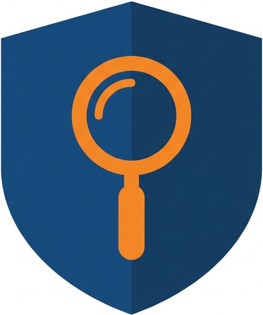

<div align="center">



# 🕵️ Insurance Claim Fraud Detection

[](https://www.python.org/downloads/)
[](https://www.typescriptlang.org/)
[](https://fastapi.tiangolo.com/)
[](https://nextjs.org/)
[](https://react.dev/)
[](https://scikit-learn.org/)
[](https://www.docker.com/)

**Machine learning prototype for detecting fraudulent insurance claims.**

🔗 **Live Demo**: [fraud-detection-demo.symfa.com](https://fraud-detection-demo-placeholder.vercel.app/)

</div>


## Overview

Fraud Detection is a machine learning prototype for identifying potentially fraudulent insurance claims. Based on the [2023 Travelers NESS Statathon Kaggle Competition](https://www.kaggle.com/competitions/2023-travelers-ness-statathon/overview), it helps insurance companies reduce financial losses, streamline investigations, and allocate resources more efficiently through automated prediction and SHAP-based explainability.

### Key Features

- **Fraud Prediction** – Classify claims as fraudulent or legitimate using trained AutoGluon models
- **Probability Scoring** – Output fraud probability and binary decision (configurable threshold)
- **Explainability** – SHAP-based feature contributions for each prediction
- **Feature Importance** – Global feature importance visualization from model training
- **Summary Generation** – Natural language summaries of prediction reasoning
- **Interactive UI** – Next.js dashboard for exploring predictions and feature impacts

### Target Audience

Claims analysts, fraud investigators, and operations teams who need to identify and prioritize potentially fraudulent claims for review.

## Tech Stack

| Category | Technologies |
|----------|-------------|
| **Backend** | Python 3.13, FastAPI |
| **Frontend** | TypeScript, Next.js, Node.js |
| **AI/ML** | AutoGluon, scikit-learn, SHAP |
| **Data Validation** | Pydantic |
| **Package Management** | uv (backend), pnpm (frontend) |
| **Deployment** | Docker |

## Dataset

The dataset contains insurance claim records from the Travelers NESS Statathon competition:

### Driver Demographics
| Feature | Description |
|---------|-------------|
| `age_of_driver` | Age of the driver |
| `gender` | Gender of the driver (M/F) |
| `marital_status` | Marital status indicator |
| `annual_income` | Annual income of the policyholder |
| `high_education_ind` | Higher education indicator |
| `living_status` | Living status (Own/Rent) |
| `zip_code` | ZIP code of the policyholder |

### Claim Information
| Feature | Description |
|---------|-------------|
| `claim_number` | Unique claim identifier |
| `claim_date` | Date of the claim |
| `claim_day_of_week` | Day of the week when claim was filed |
| `accident_site` | Location type of the accident |
| `past_num_of_claims` | Number of past claims |
| `witness_present_ind` | Whether a witness was present |
| `liab_prct` | Liability percentage |
| `channel` | Claim submission channel |
| `policy_report_filed_ind` | Whether a policy report was filed |
| `claim_est_payout` | Estimated claim payout amount |

### Vehicle Information
| Feature | Description |
|---------|-------------|
| `age_of_vehicle` | Age of the vehicle |
| `vehicle_category` | Category of the vehicle |
| `vehicle_price` | Price of the vehicle |
| `vehicle_color` | Color of the vehicle |
| `vehicle_weight` | Weight of the vehicle |
| `safty_rating` | Safety rating of the vehicle |

### Target Variable
| Feature | Description |
|---------|-------------|
| `fraud` | **Target** (1 = Fraudulent, 0 = Legitimate) |

## Project Structure

```
fraud-detection/
├── backend/                        # Python backend (FastAPI)
│   ├── Dockerfile                  # Backend container
│   ├── src/fraud_detection/        # Application code
│   ├── models/                     # Trained ML model artifacts
│   ├── notebooks/                  # Jupyter notebooks (EDA, experiments)
│   ├── scripts/                    # Training & preprocessing scripts
│   ├── data/                       # Datasets
│   └── pyproject.toml              # Backend dependencies
│
├── frontend/                       # Next.js frontend application
│   └── Dockerfile                  # Frontend container
│
├── pyproject.toml                  # UV workspace definition
├── uv.lock                         # Lockfile
└── README.md
```

## Getting Started

### Prerequisites

- Python 3.13+
- Node.js 18+
- [uv](https://github.com/astral-sh/uv) package manager (backend)
- [pnpm](https://pnpm.io/) package manager (frontend)

### Installation

```bash
# Clone the repository
git clone https://github.com/Symfa-Inc/fraud-detection.git
cd fraud-detection

# Install backend dependencies
uv sync

# Install frontend dependencies
cd frontend
pnpm install
```

### Running Locally

**Backend:**
```bash
uv run uvicorn fraud_detection.main:app --port 8000 --reload
```

**Frontend:**
```bash
cd frontend
pnpm run dev
```

The backend API will be available at `http://localhost:8000` and the frontend at `http://localhost:3000`.

### Running with Docker

**Backend** (from `backend/` directory):
```bash
cd backend
docker build -t fraud-detection-backend .
docker run -p 8000:8000 fraud-detection-backend
```

**Frontend** (from `frontend/` directory):
```bash
cd frontend
docker build -t fraud-detection-frontend .
docker run -p 3000:3000 -e API_URL=http://localhost:8000 fraud-detection-frontend
```

Set `API_URL` to your backend URL when the frontend runs in a different host/container.

## References

- [2023 Travelers NESS Statathon on Kaggle](https://www.kaggle.com/competitions/2023-travelers-ness-statathon/overview)
- [Travelers Insurance](https://www.travelers.com/)
